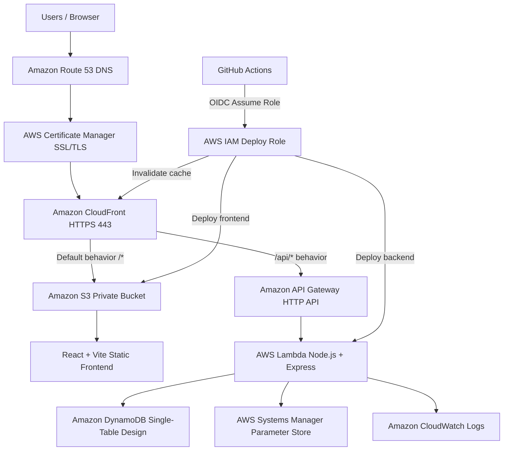
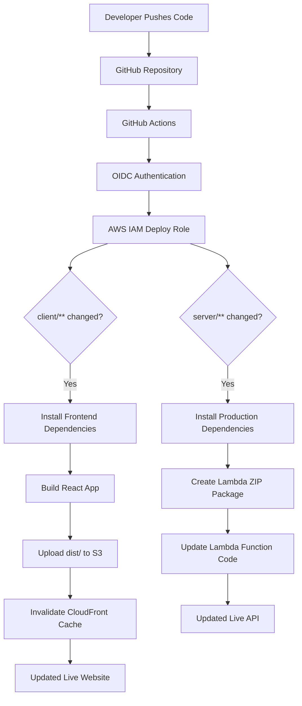
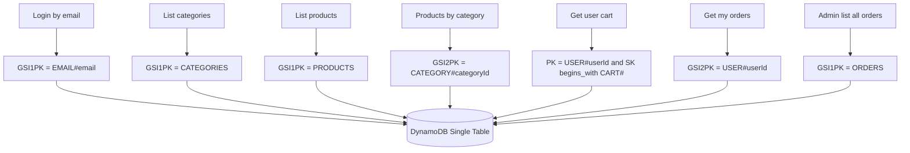
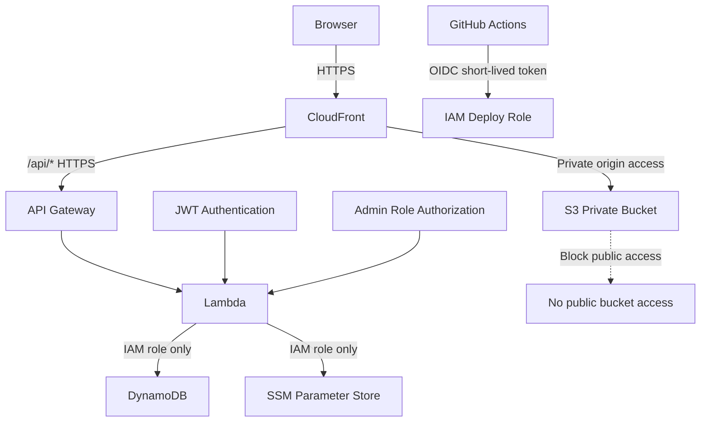

# ServerlessShop — Serverless AWS E-Commerce Platform

A production-style **serverless e-commerce application** built with **React + Vite, Node.js, Express, AWS Lambda, API Gateway, DynamoDB, S3, CloudFront, Route 53, ACM, SSM Parameter Store, IAM, CloudWatch, and GitHub Actions OIDC CI/CD**.

This project demonstrates how a traditional full-stack application can be modernized into a scalable, secure, cost-efficient, and fully serverless AWS architecture.

---

## Live Demo

**Application URL:** `https://serverless.rifkhan.xyz`

> Note: AWS resources may be stopped or deleted later to avoid cloud costs, but the full architecture, deployment proof, screenshots, and source code are documented in this repository.

---

## Project Showcase


---

## Project Summary

**ServerlessShop** is a full-stack e-commerce platform that supports customer shopping flows and admin management features. The backend was modernized from a MySQL-style application into a serverless AWS backend using **Lambda + API Gateway + DynamoDB**.

The project includes:

- JWT authentication and role-based authorization
- Admin-only product and category management
- Product browsing, filtering, and searching
- Cart management
- Order creation and order status management
- Private S3 frontend hosting through CloudFront
- Serverless Express backend running on AWS Lambda
- DynamoDB single-table design
- SSM Parameter Store for production configuration and secrets
- GitHub Actions CI/CD using AWS OIDC with no long-lived IAM access keys

---

## Architecture Diagram


### High-Level Architecture Flow



---

## Serverless Architecture

```text
User Browser
    ↓
Route 53 Custom Domain
    ↓
ACM SSL Certificate
    ↓
CloudFront HTTPS Distribution
    ├── Default behavior /*
    │       ↓
    │   Private S3 Bucket
    │       ↓
    │   React + Vite Static Frontend
    │
    └── API behavior /api/*
            ↓
        API Gateway HTTP API
            ↓
        AWS Lambda
            ↓
        Amazon DynamoDB
```

---

## CI/CD Pipeline




### CI/CD Highlights

- GitHub Actions uses **OIDC authentication** with AWS
- No IAM user access keys are stored in GitHub
- Frontend and backend deploy independently
- Frontend changes deploy to S3 and invalidate CloudFront
- Backend changes package the Express API and update Lambda
- Path-based workflows reduce unnecessary deployments

---

## Application Features

### Customer Features

- User registration and login
- JWT-based authentication
- Browse products
- Search products by name or description
- Filter products by category
- Add products to cart
- Update cart quantity
- Remove cart items
- Place orders
- View personal orders

### Admin Features

- Admin-only protected routes
- Create categories
- Delete categories
- Create products
- Update products
- Soft delete products
- View all customer orders
- Update order status

### Cloud / DevOps Features

- Serverless Express backend using AWS Lambda
- API Gateway HTTP API integration
- DynamoDB single-table design
- Private S3 frontend hosting
- CloudFront CDN with `/api/*` API routing
- Route 53 custom domain
- ACM SSL certificate
- SSM Parameter Store for secrets and configuration
- IAM least-privilege roles
- CloudWatch logs and monitoring
- GitHub Actions CI/CD with OIDC

---

## Technology Stack

| Layer | Technology |
|---|---|
| Frontend | React, Vite, JavaScript |
| Frontend Hosting | Amazon S3 private bucket, Amazon CloudFront |
| Domain & SSL | Amazon Route 53, AWS Certificate Manager |
| Backend | Node.js, Express.js, serverless-http |
| Compute | AWS Lambda |
| API Layer | Amazon API Gateway HTTP API |
| Database | Amazon DynamoDB |
| Secrets & Config | AWS Systems Manager Parameter Store |
| Security | IAM roles, JWT, private S3, GitHub OIDC |
| CI/CD | GitHub Actions |
| Monitoring | Amazon CloudWatch |

---

## AWS Services Used

| Category | Services |
|---|---|
| Frontend Delivery | S3, CloudFront |
| Domain & HTTPS | Route 53, ACM |
| Backend API | API Gateway, Lambda |
| Database | DynamoDB |
| Security | IAM, SSM Parameter Store, JWT |
| CI/CD | GitHub Actions, OIDC IAM Role |
| Monitoring | CloudWatch |

---

## DynamoDB Single-Table Design

### Table Configuration

```text
Table name: serverlessshop-prod
Partition key: PK
Sort key: SK
Billing mode: PAY_PER_REQUEST
GSI1: GSI1PK + GSI1SK
GSI2: GSI2PK + GSI2SK
```

### Entity Patterns

| Entity | PK | SK | Purpose |
|---|---|---|---|
| User | `USER#userId` | `PROFILE` | User profile and authentication data |
| Category | `CATEGORY#categoryId` | `METADATA` | Product categories |
| Product | `PRODUCT#productId` | `METADATA` | Product information |
| Cart Item | `USER#userId` | `CART#productId` | User cart items |
| Order | `ORDER#orderId` | `METADATA` | Order data and embedded order items |

### DynamoDB Access Patterns



---

## API Endpoints

### Authentication

| Method | Endpoint | Access |
|---|---|---|
| POST | `/api/auth/register` | Public |
| POST | `/api/auth/login` | Public |
| GET | `/api/auth/me` | Authenticated |

### Categories

| Method | Endpoint | Access |
|---|---|---|
| GET | `/api/categories` | Public |
| POST | `/api/categories` | Admin |
| DELETE | `/api/categories/:id` | Admin |

### Products

| Method | Endpoint | Access |
|---|---|---|
| GET | `/api/products` | Public |
| GET | `/api/products/:id` | Public |
| POST | `/api/products` | Admin |
| PUT | `/api/products/:id` | Admin |
| DELETE | `/api/products/:id` | Admin |

### Cart

| Method | Endpoint | Access |
|---|---|---|
| GET | `/api/cart` | Authenticated |
| POST | `/api/cart` | Authenticated |
| PUT | `/api/cart/:id` | Authenticated |
| DELETE | `/api/cart/:id` | Authenticated |

### Orders

| Method | Endpoint | Access |
|---|---|---|
| POST | `/api/orders` | Authenticated |
| GET | `/api/orders/my-orders` | Authenticated |
| GET | `/api/orders` | Admin |
| PUT | `/api/orders/:id/status` | Admin |

---

## Security Design



### Security Highlights

| Component | Security Approach |
|---|---|
| S3 | Private bucket, no public access |
| CloudFront | Single public entry point with HTTPS |
| API Gateway | Public API entry routed through `/api/*` |
| Lambda | IAM execution role with least privilege |
| DynamoDB | Accessible only through Lambda IAM role |
| SSM Parameter Store | Stores secrets and production configuration |
| GitHub Actions | Uses OIDC instead of IAM access keys |
| Application Auth | JWT authentication and admin-only routes |

---

## Environment Variables

### Frontend

```env
VITE_API_BASE_URL=/api
```

### Lambda Production

```env
NODE_ENV=production
AWS_REGION=ap-south-1
SSM_PARAMETER_PREFIX=/serverlessshop
```

### SSM Parameter Store

```text
/serverlessshop/jwt/secret
/serverlessshop/jwt/expires-in
/serverlessshop/cors/origin
/serverlessshop/dynamodb/table-name
```

---

## Project Structure

```text
serverlessshop/
├── client/
│   ├── src/
│   ├── public/
│   ├── .env
│   └── package.json
│
├── server/
│   ├── src/
│   │   ├── app.js
│   │   ├── lambda.js
│   │   ├── server.js
│   │   ├── config/
│   │   │   ├── env.js
│   │   │   ├── ssm.js
│   │   │   └── db.js
│   │   ├── db/
│   │   │   └── dynamodb.js
│   │   ├── controllers/
│   │   ├── services/
│   │   ├── routes/
│   │   ├── middleware/
│   │   └── utils/
│   └── package.json
│
├── .github/
│   └── workflows/
│       ├── deploy-frontend.yml
│       └── deploy-backend.yml
│
├── docs/
│   ├── images/
│   
│
└── README.md
```
---

## Deployment Flow

### Frontend Deployment

```bash
cd client
npm run build
aws s3 sync dist/ s3://YOUR_FRONTEND_BUCKET --delete
aws cloudfront create-invalidation --distribution-id YOUR_DISTRIBUTION_ID --paths "/*"
```

### Backend Deployment

```bash
cd server
npm ci --omit=dev
zip -r serverlessshop-api.zip . -x ".env" "*.zip" "node_modules/.cache/*"
aws lambda update-function-code \
  --function-name serverlessshop-api \
  --zip-file fileb://serverlessshop-api.zip
```

---

## GitHub Actions CI/CD Workflows

| Workflow | Trigger | Deployment |
|---|---|---|
| `deploy-frontend.yml` | `client/**` | Build React, upload to S3, invalidate CloudFront |
| `deploy-backend.yml` | `server/**` | Package backend ZIP, update Lambda |

This keeps deployments efficient because frontend-only changes do not redeploy the backend, and backend-only changes do not rebuild the frontend.

---

## Screenshots 

### Live Application


### Home Page


### Products Page


### Product Details Page


### Cart Page


### Checkout / Order Page


### Admin Dashboard


### Admin Product Management


### Route 53 Domain


### ACM Certificate


### CloudFront Distribution


### CloudFront Behaviors


### S3 Private Bucket


### API Gateway HTTP API


### Lambda Function


### DynamoDB Table


### DynamoDB Items


### SSM Parameter Store


### IAM Lambda Role


### GitHub Actions Frontend Success


### GitHub Actions Backend Success


---

## Problems Solved

### 1. Frontend calling localhost in production

Problem:

```text
POST http://localhost:5000/api/auth/register net::ERR_CONNECTION_REFUSED
```

Reason:

The production frontend bundle was built with the local API URL.

Solution:

```env
VITE_API_BASE_URL=/api
```

CloudFront routes `/api/*` to API Gateway, so the browser uses the same domain for frontend and backend.

---

### 3. Deploying Express on Lambda

The Express app is wrapped with `serverless-http`, allowing the same application structure to run on AWS Lambda behind API Gateway.

---

### 4. Securing CI/CD without IAM access keys

GitHub Actions uses OIDC to assume an AWS IAM role. This avoids storing long-lived AWS credentials in GitHub secrets.

---

## What This Project Demonstrates

This project proves hands-on experience with:

- Full-stack application deployment on AWS
- Serverless backend modernization
- Express.js running on AWS Lambda
- API Gateway HTTP API integration
- DynamoDB single-table design
- S3 private frontend hosting
- CloudFront CDN and `/api/*` routing
- Route 53 custom domain and ACM SSL
- Secure secrets management with SSM Parameter Store
- IAM least-privilege permissions
- GitHub Actions OIDC CI/CD
- Production-style cloud architecture documentation

---

## Future Improvements

- Add DynamoDB `TransactWriteItems` for stronger checkout consistency
- Add Terraform or CloudFormation infrastructure automation
- Add CloudWatch alarms and dashboards
- Add Lambda aliases and deployment versions
- Add blue/green Lambda deployments
- Add S3 pre-signed URL product image uploads
- Add payment gateway integration
- Add admin analytics dashboard
- Add automated API tests in GitHub Actions
- Add WAF protection for CloudFront

---

## Professional Summary

This project demonstrates the ability to design, build, migrate, secure, and deploy a real-world serverless e-commerce application on AWS using modern cloud-native and DevOps practices.

The most important production concept implemented in this project is:

```text
The browser uses one secure public domain.
CloudFront serves the React frontend from private S3.
CloudFront routes /api/* requests to API Gateway.
API Gateway invokes Lambda.
Lambda accesses DynamoDB and SSM using IAM roles.
GitHub Actions deploys through OIDC without static AWS keys.
```

---

## Author

**Mohammed Rifkhan**

AWS Certified Solutions Architect Associate  
Fullstack Developer | Cloud & DevOps Learner

